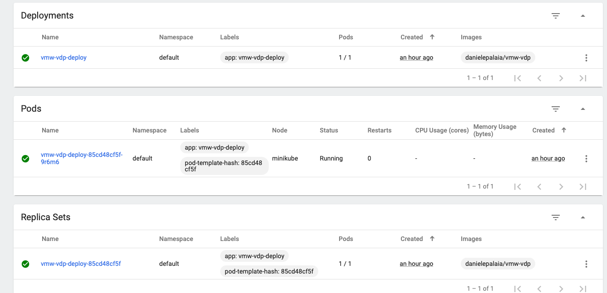
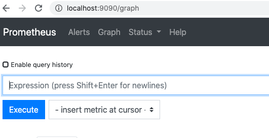
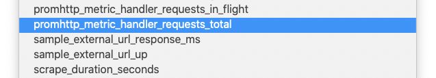
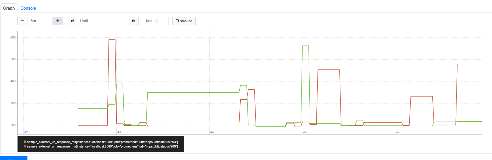

# vmw-vdp
This is an exercice project using the following tech stack: Golang, Docker, K8s and Prometheus. </br>

## Requirements:
* A service written in golang that queries 2 urls (https://httpstat.us/503 & https://httpstat.us/200) </br>
* The service will check the external urls (https://httpstat.us/503 & https://httpstat.us/200 ) are up (based on http status code 200) and response time in milliseconds </br>
* The service will run a simple http service that produces  metrics (on /metrics) and output a prometheus format when hitting the service /metrics url </br></br>
Expected response format:

```
sample_external_url_up{url="https://httpstat.us/503 "}  = 0
sample_external_url_response_ms{url="https://httpstat.us/503 "}  = [value]
sample_external_url_up{url="https://httpstat.us/200 "}  = 1
sample_external_url_response_ms{url="https://httpstat.us/200 "}  = [value]
```
Others requirements:
* Dockerfile to build image
* Kubernetes Deployment Specification to deploy Image to Kubernetes Cluster
* Unit Tests

## Design:
The project is written in GO </br></br>
The project is divided in several packages to make code modular and reusable. It is composed by the following modules: </br>
* **controllers:** This package contains the logic of the endpoints functions</br>
* **environments:** This package contains the environment settings of the project</br>
* **prometheus:** This packate embeds the prometheus functionalities in order for the callback to set the metrics in the prometheus gauges </br>
* **utilities:** This package contains utilities functions which ba be used in other projects if necessary</br>
* **main:** This is the main package, it is composed by the service.go file which contains the main function and the route.go file which is used for manage and routing callback using gorilla. </br>

Given that the project needs to be run locally, on Docker and on Kubernetes, all initialization parameters of the project are taken in input from O.S. environment variables. I will explaines in a next paragraph how to set them for Docker and K8s. For the moment just to mention that the variables needed are the following:
* **host**: This one set the address where teh service will listen/will be binded
* **port**: We need the port as well
* **numUrls**: This represents the number or Urls the service will call. I wanted to extend the requirements of the project and allow it to be able to manage as many urls we want
* **url1 - url2 - url3...**: The url we want to manage (specify as many as you put in numUrls </br>

The service exposes two endpoints:  </br>
* **/service** which is the endpoint calling the urls specified  </br>
* **/metrics** which is the endpoint that will manage the metrics that prometheus will monitor </br> </br>

The framework **Gorilla** has been chosen to make the web-server extensible in order to be able to add new endpoints for different. To add a new endpoint is enough to add the logic inside routes.go and define a new function inside the controllers package </br>

The main endpoint is the /service endpoint when this one is invoked for example with a:</br></br>
**curl localhost:8080/service**</br></br>
The endpoint defined will submit internally an http request to the url specified and still store the result: 0 or 1 depending on the http code returned and store the response time inside a different metric, the endpoint will finally reply with a 200OK to the client.</br>
The endpoint /metrics is by default implemented by the prometheus Handler promhttp.Handler()

## Run the project:
The project can be run: locally, on Docker, on K8s.

### Run it locally: 
You have two options: I provided binaries for Linux and OSX you can just run the binary </br>
* **./vmw-vdp**. 
You may want to compile and build the project for another O.S. or do some fix in this case I'm using the modules of GO so all dependencies should be downloaded automatically when you do a: </br>
* **go build**
</br>
In any case before running it you need to setup O.S. env variables that you can find in the file set-env.sh in the same directory of the binary.

### Run it on docker: 

I created an image of the project and pushed it in public repo of my **dockerhub** profile at: </br>
https://hub.docker.com/repository/docker/danielepalaia/vmw-vdp
</br>
Also a simple dockerfile has been provided (the same one pushed on dockerhub) and you can find it in the repo </br>

```
# Start from a Debian image with the latest version of Go installed
# and a workspace (GOPATH) configured at /go.
FROM golang

# Copy the local package files to the container's workspace.
ADD . /go/src/vmw-vdp

# Build the outyet command inside the container.
# (You may fetch or manage dependencies here,
# either manually or with a tool like "godep".)
RUN go install vmw-vdp

# Run the outyet command by default when the container starts.
ENTRYPOINT /go/bin/vmw-vdp

# Document that the service listens on port 8080.
EXPOSE 8080
```

You can then build the image from his: </br>

* **docker build -t vmw-dp  .**

you can then run it passing the env variables needed: </br>

* **docker run -e host=localhost -e port=8080 -e numUrls=2 -e url1=https://httpstat.us/503 -e url2=https://httpstat.us/200 --publish 8080:8080 --name vmw-vdp-container-last vmw-dp** </br>

You can then submit requests using cur locally on port 8080

### Run it on Kubernetes: 

Environment variables are taken from pod using usually config maps (no password necessary here so no secrets necessary). <br>

You can create a config map like this (please find the .yaml file inside the Kuebernetes directory in order to run it with kubectl create -f): </br>

* **kubectl create cm vmw-vdp-map --from-literal=host=0.0.0.0 --from-literal=port=8080 --from-literal=numUrls=2 --from-literal=url1=https://httpstat.us/503 --from-literal=url1=https://httpstat.us/200**


Docker public image is uploaded in Dockerhub in danielepalaia/vmw-vdp repo. To get a deployment spec you can simply: </br>

* **kubectl create deployment vmw-vdp-deploy --image=danielepalaia/vmw-vdp --dry-run --replicas=1 -o yaml > vmw-vdp-deploy.yaml** </br>

and then from here adding the configmap env variable to the pod like this:

```
spec:
      containers:
      - image: danielepalaia/vmw-vdp
        name: vmw-vdp
        envFrom:
        - configMapRef:
            name: vmw-vdp-map
```

* Please find the mw-vdp-deploy.yaml with the full Deployment spec inside the Kubernetes directory of this project. 
I tried the project with minikube. Minikube doesn't allow the creation of load balancer service. </br>

To test this simple project you can simply use port-forward (assuming you have just one pod) and then use curl as done before: </br>

Alternatively you can kubectl expose service to create a service of type LoadBalancer

```
dpalaia-a01:vmw-vdp dpalaia$ kubectl get pod
NAME                              READY   STATUS    RESTARTS   AGE
vmw-vdp-deploy-85cd48cf5f-9r6m6   1/1     Running   0          18m
dpalaia-a01:vmw-vdp dpalaia$ kubectl port-forward vmw-vdp-deploy-85cd48cf5f-9r6m6 8080:8080
Forwarding from 127.0.0.1:8080 -> 8080
Forwarding from [::1]:8080 -> 8080
Handling connection for 8080
```

<br/>


## Try the project:

Once exectued in one way or another the service should be listening in the two endpoints:

You can try /metrics:

```
dpalaia-a01:vmw-vdp dpalaia$ curl http://localhost:8080/metrics
# HELP go_gc_duration_seconds A summary of the pause duration of garbage collection cycles.
# TYPE go_gc_duration_seconds summary
go_gc_duration_seconds{quantile="0"} 3.413e-05
go_gc_duration_seconds{quantile="0.25"} 3.7934e-05
go_gc_duration_seconds{quantile="0.5"} 4.2172e-05
...
```

Then you can call curl http://localhost:8080/service to start calling the two urls. You should then see in the /metrics the new metrics created:

```# HELP sample_external_url_response_ms response time of the url
# TYPE sample_external_url_response_ms gauge
sample_external_url_response_ms{url="https://httpstat.us/200"} 198
sample_external_url_response_ms{url="https://httpstat.us/503"} 276
# HELP sample_external_url_up is url up or down
# TYPE sample_external_url_up gauge
sample_external_url_up{url="https://httpstat.us/200"} 1
sample_external_url_up{url="https://httpstat.us/503"} 0
```

## Prometheus integration:

Prometheus offer different kind of metrics. For this simple service gauge metrics have been chosen. </br>

Once this service is up you can run Prometheus to receive metrics from the end point:  </br>

* ./prometheus --config.file=prometheus.yml

Prometheus take one configuration file. You can use the default one and just modify the target:

```
static_configs:
    - targets: ['localhost:8080']
```

Prometheus has a web interface where you can already monitor metrics: </br>

<br/>


You can find the new metrics from this service: </br>

<br/>

And the graph (after some modifications on the response time, the other metric for these two urls is meaningless because they return always ok or no)

<br/>


## Unit tests:

Unit tests have been provided: Run 
* go test -v ./...
To run them and 
* go tool cover -html=coverage.out

To see code covered 


## Improvements:

This was just an exercise so I tried to make things easy. Possible improvements of the project are the following

* The /service end point doesn't take an input and it returns just an Ok/error message. Maybe this can be expanded, the client could request in input as .json the urls to call, how many times to run them and for how long (just as an example). In this case more tests should be done in order to mock request/response
* The kubernetes Objects could be packaged in a helm chart. But as we have just one deployment and one config map I tought was fine like this
* In case we have a test/production environment a pipeline should be created in order to git push -> run tests -> deploy in test/prod
* Grafana dashboards: Initially I planned to use it as the graph are much better but as I discovered Prometheus as already a basic graph I just used that one.


